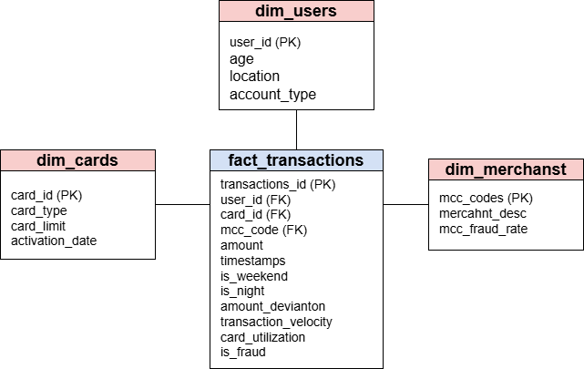

# Financial Fraud Detection — Big Data Pipeline

## What this project does

This project implements a complete end-to-end big data pipeline for detecting financial fraud and analyzing spending behaviour across millions of credit/debit card transactions.

Key questions it answers:
- Which merchant categories (MCC codes) have the highest fraud rates?
- What time-of-day and day-of-week patterns are associated with fraud?
- How does spending behaviour differ across age groups and card types?
- Which behavioral features (velocity, deviation, utilization) best predict fraud?
- Can a machine learning model reliably flag suspicious transactions in near-real-time?

---

## Prerequisites

| Tool | Version |
|------|---------|
| Docker Desktop | Latest |
| Python | 3.9+ |
| PySpark | 3.3+ |
| Jupyter | Latest |
| psycopg2 | `pip install psycopg2-binary` |
| pymongo | `pip install pymongo` |
| pandas | `pip install pandas` |
| pyarrow | `pip install pyarrow` (for parquet) |

Install all Python dependencies at once:
```bash
pip install pyspark jupyter psycopg2-binary pymongo pandas pyarrow
```

---

## How to run the full pipeline

### Step 1 — Start the databases

```bash
docker-compose up -d
```

This starts:
- **PostgreSQL** on `localhost:5432` (database: `fraud_db`, user/pass: `postgres/postgres`)
- **MongoDB** on `localhost:27017` (database: `fraud_mongo`)

Wait ~10 seconds for both containers to become healthy.

### Step 2 — Ingest raw data into PostgreSQL

```bash
python scripts/ingestion.py
```

This reads all five dataset files, logs their metadata to `scripts/ingestion_log.json`, and loads the three CSV files into the `raw` schema in PostgreSQL as:
- `raw.raw_transactions`
- `raw.raw_cards`
- `raw.raw_users`

### Step 3 — Batch processing (Spark)

Open and run all cells in order:

```bash
jupyter notebook notebooks/batch_processing.ipynb
```

This cleans the data, joins all sources, engineers features, runs aggregations, and saves everything to `/processed`.

### Step 4 — Streaming simulation (Spark Structured Streaming)

```bash
jupyter notebook notebooks/streaming_simulation.ipynb
```

This splits the enriched data into 1000-row batches and runs a Structured Streaming job that detects suspicious transactions in each micro-batch.

### Step 5 — Create analytical schema in PostgreSQL

```bash
python scripts/create_schema.py
```

Creates the star schema (`curated` schema) and loads all dimension and fact tables from the enriched parquet.

### Step 6 — Load MongoDB collections

```bash
python scripts/load_mongo.py
```

Loads MCC code lookup data and computed merchant profiles into MongoDB.

### Step 7 — Train fraud detection model

```bash
jupyter notebook notebooks/fraud_model.ipynb
```

Trains a Random Forest with 100 trees, evaluates it, and saves the model and metrics.

---

## Folder structure

```
project/
├── raw/                        # Original dataset files — NEVER modified
│   ├── transactions_data.csv   # Main transactions (millions of rows)
│   ├── cards_data.csv          # Card details (type, limit, activation)
│   ├── users_data.csv          # User demographics
│   ├── mcc_codes.json          # Merchant category code descriptions
│   └── train_fraud_labels.json # Binary fraud labels per transaction
│
├── processed/                  # Spark parquet outputs
│   ├── transactions_enriched/  # Full joined + feature-engineered dataset
│   ├── fraud_rate_by_mcc/      # Aggregation: fraud rate per MCC
│   ├── avg_amount_by_age_group/# Aggregation: average amount by age group
│   ├── fraud_count_by_time/    # Aggregation: fraud count by hour/day
│   ├── fraud_rate_by_card_type/# Aggregation: fraud rate per card type
│   ├── stream_input/           # 1000-row batch parquet files for streaming
│   └── stream_output/          # Suspicious transactions from streaming
│
├── curated/                    # Final outputs
│   ├── fraud_model/            # Saved PySpark RandomForest model
│   └── model_metrics.json      # AUC, precision, recall, F1
│
├── notebooks/
│   ├── batch_processing.ipynb  # Step 3: Spark batch ETL + features
│   ├── streaming_simulation.ipynb # Step 4: Structured Streaming
│   └── fraud_model.ipynb       # Step 7: ML training & evaluation
│
├── scripts/
│   ├── ingestion.py            # Step 2: file ingestion + PostgreSQL load
│   ├── ingestion_log.json      # Auto-generated metadata log
│   ├── create_schema.py        # Step 5: star schema creation + load
│   └── load_mongo.py           # Step 6: MongoDB collections load
│
├── screenshots/                # Evidence screenshots for submission
└── docker-compose.yml          # PostgreSQL + MongoDB containers
```

---

## Dataset

Download the original dataset here:
[Data_Engineering_BI_Exercise.zip](https://zcs-demo-dataset.s3.us-east-1.amazonaws.com/Data_Engineering_BI_Exercise.zip)

---

## Star schema (PostgreSQL — schema: curated)



### Table descriptions

| Table | Description |
|-------|-------------|
| `dim_users` | One row per customer with demographic attributes |
| `dim_cards` | One row per card with type, credit limit, and activation date |
| `dim_merchants` | One row per MCC code with description and historical fraud rate |
| `fact_transactions` | Central fact table with one row per transaction; FK references to all dimensions; contains engineered features and the fraud label |

---

## Engineered features

| Feature | Description |
|---------|-------------|
| `transaction_velocity` | Number of transactions by the same user in the past 3 hours |
| `amount_deviation` | How many standard deviations the amount is from the user's mean: `(amount − μ) / σ` |
| `is_weekend` | `true` if the transaction occurred on Saturday or Sunday |
| `is_night` | `true` if the transaction occurred between 22:00 and 06:00 |
| `mcc_fraud_rate` | Historical fraud rate for the transaction's merchant category |
| `card_utilization` | `amount / card_limit` — how much of the credit limit was used |

---

## Model results

> Fill in after running `notebooks/fraud_model.ipynb`

| Metric | Value |
|--------|-------|
| AUC | _(see curated/model_metrics.json)_ |
| Accuracy | _(see curated/model_metrics.json)_ |
| Weighted Precision | _(see curated/model_metrics.json)_ |
| Weighted Recall | _(see curated/model_metrics.json)_ |
| Weighted F1-Score | _(see curated/model_metrics.json)_ |
| Top feature | _(see curated/model_metrics.json)_ |

---

## Stopping the stack

```bash
docker-compose down
```

To also remove the persisted database volumes:

```bash
docker-compose down -v
```
